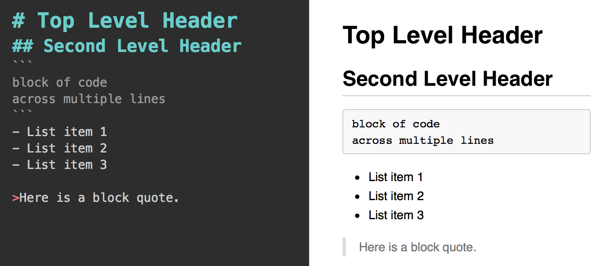
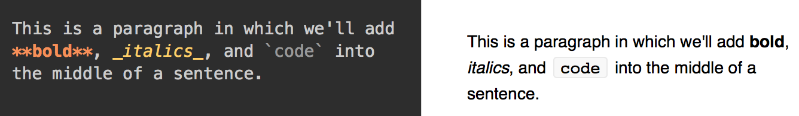
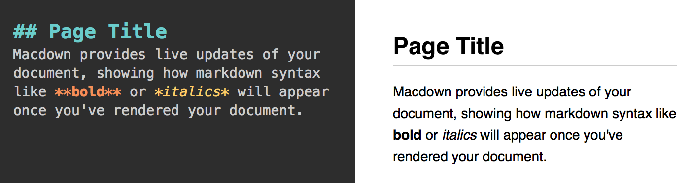

<<<<<<< HEAD
# Module 14: Shiny

## Overview
In this (brief) learning module, we introduce the Shiny framework for building interactive applications in R. Shiny provides a structure for communicating between a user-interface (i.e., a web-browser) and an R session. This not only enables developers to create interactive graphics, but provides a way for users to interact directly with a R session (without writing any code!).
=======
# Module 3: Markdown

## Overview
Markdown syntax provides a simple way to describe the desired formatting of text documents. In fact, all of the learning modules (including this one you're reading) were written using Markdown! With only a small handful of options, Markdown allows you to provide structure to a document, as well as formatting to your text (like **bold**, or _italics_). There are a number of programs that support the rendering of Markdown, including GitHub, Slack, and StackOverflow (note: the syntax implementation may vary slightly across programs). In this section, you'll learn the basics of Markdown syntax, and how to leverage it.
>>>>>>> 86e548ff7f88a599894b00c08c42b07df47a685a

<!-- START doctoc generated TOC please keep comment here to allow auto update -->
<!-- DON'T EDIT THIS SECTION, INSTEAD RE-RUN doctoc TO UPDATE -->
**Contents**

- [Resources](#resources)
<<<<<<< HEAD
- [Using Multiple R Files](#using-multiple-r-files)
- [Shiny](#shiny)
  - [Application Architecture](#application-architecture)
  - [User Interface (ui.R)](#user-interface-uir)
  - [Server code (server.r)](#server-code-serverr)
- [Publishing ShinyApps](#publishing-shinyapps)
=======
- [Writing Markdown](#writing-markdown)
  - [Document Structure](#document-structure)
  - [Text formatting](#text-formatting)
- [Rendering Markdown](#rendering-markdown)
  - [Markdown Reader (Chrome Extension)](#markdown-reader-chrome-extension)
  - [Online Editors](#online-editors)
  - [Macdown](#macdown)
>>>>>>> 86e548ff7f88a599894b00c08c42b07df47a685a

<!-- END doctoc generated TOC please keep comment here to allow auto update -->

## Resources
<<<<<<< HEAD
- [Shiny Website](http://shiny.rstudio.com/)
- [Shiny Basics](http://shiny.rstudio.com/articles/basics.html)
- [Shiny Tutorial](http://shiny.rstudio.com/tutorial/)
- [Shiny Widgets](http://shiny.rstudio.com/gallery/widget-gallery.html)
- [shinyapps.io](https://www.shinyapps.io)
- [ShinyApps User Guide](http://docs.rstudio.com/shinyapps.io/index.html)

## Using Multiple R Files
As projects begin to scale in size and complexity, it's common to use multiple R scripts to perform your analysis. In the same way that we can use the `library` function to load R code into our session, we can use the `source` function to _load our own R scripts_. For example, imagine you have a file in which you write an R function for building a map:

```r
# buildMap.R

BuildMap <- function(...) {
    # build a map using the data passed into this function

    # Return your map
}
```

You could then leverage this function in another R script by using the `source` function to load your file:

```r
# analysis.R file: using other file's function, build a map

# Make sure your directory is properly set
setwd(...)

# Use the source function to load your file
source('./scripts/buildMap.R')

# Pass data to your function that you can now use
df <- read.csv('some/csv/file')
buildMap(df)
```

To practice breaking your code into multiple files, see [exercise-1](exercise-1).

## Shiny
Shiny is a **web application framework for R**. As opposed to a simple (static) web page, a _web application_ supports more sophisticated interactions, and often connects multiple programming environments (i.e., passing information between multiple machines).

### Application Architecture
In order to use Shiny, you'll need to have a strong understanding of how a Shiny App is organized. [This article](http://shiny.rstudio.com/articles/basics.html) outlines it pretty clearly. In short, you'll have two scripts: one to describe the **user interface** (`ui.R`), and another to describe the code to execute in R (`server.R`).

### User Interface (ui.R)
The user interface of your application (i.e., how your app will be displayed to your user in a web browser) is described by your `ui.R` file. Similarly to using RMarkdown, it can render R content such as text or graphics. However, it also allows you to create **widgets**, which are interactive controls that affect your application. Here is a simple example of writing out a user-interface (for more widgets, see [here](http://shiny.rstudio.com/gallery/widget-gallery.html)):

```r
# From http://shiny.rstudio.com/articles/basics.html
library(shiny)

# Define UI for application that draws a histogram
shinyUI(fluidPage(

  # Application title
  titlePanel("Hello Shiny!"),

  # Sidebar with a slider input for the number of bins
  sidebarLayout(
    sidebarPanel(
      sliderInput("bins",
                  "Number of bins:",
                  min = 1,
                  max = 50,
                  value = 30)
    ),

    # Show a plot of the generated distribution
    mainPanel(
      plotOutput("distPlot")
    )
  )
))
```

The above code defines a user-interface's layout using _panels_, or sections of a page. The segment above would render this UI:


If you dissect the code, you can start to see how each element is rendered in the UI. However, it doesn't make clear where the element `"distPlot"` is coming from. That's the other half of our project, in `server.R`.

### Server code (server.r)
Your user interface (`ui.R`) is populated with information from an R session (which we'll think of as the _server_ for our application). The Shiny architecture allows you to pass information back and forth between the user-interface and the server. Here is the corresponding `server.R` code for the UI above:

```r
# From: http://shiny.rstudio.com/articles/basics.html
library(shiny)

# Define server logic required to draw a histogram
shinyServer(function(input, output) {

  # Expression that generates a histogram. The expression is
  # wrapped in a call to renderPlot to indicate that:
  #
  #  1) It is "reactive" and therefore should be automatically
  #     re-executed when inputs change
  #  2) Its output type is a plot

  output$distPlot <- renderPlot({
    x    <- faithful[, 2]  # Old Faithful Geyser data
    bins <- seq(min(x), max(x), length.out = input$bins + 1)

    # draw the histogram with the specified number of bins
    hist(x, breaks = bins, col = 'darkgray', border = 'white')
  })

})
```

Note, the `distPlot` is stored as part of the server's _output_ (`output$distPlot`). It is then **accessible in the UI**, and can be rendered using the `plotOutput` function.

Similarly, you should note that the UI has a `sliderInput` called **`bins`**. We can then **reference the UI information** in our `server.R` file by saying `input$bins` (i.e., `bins` is stored as part of the `input` that the _server_ receives).

To actually run your Shiny app, click on the **Run App** button in R Studio:


To see these scripts in action, see [demo-1](demo-1), or practice with [exercise-2](exercise-2).

## Publishing ShinyApps
Sharing a ShinyApp with the world is a bit more involved than simply pushing your code to GitHub(though still quite painless). We can just use GitHub because, in addition to needed a web host, we need a session of R running that the UI can connect to. In this class, we'll introduce [shinyapps.io](https://www.shinyapps.io).

You'll need to create an account on [shinyapps.io](https://www.shinyapps.io), then you can publish your apps using the **publish** button:


You should then be able to access your app at `https://USERNAME.shinyapps.io/PROJECT-NAME/`. For more information and troubleshooting, see the [documentation](http://docs.rstudio.com/shinyapps.io/index.html).
=======
- [Original Markdown Source](https://daringfireball.net/projects/markdown/)
- [GitHub Markdown Basics](https://help.github.com/articles/basic-writing-and-formatting-syntax/)
- [Slack Markdown](https://get.slack.help/hc/en-us/articles/202288908-Formatting-your-messages)
- [StackOverflow Markdown](http://stackoverflow.com/editing-help)
- [Markdown Reader Chrome Extension](https://chrome.google.com/webstore/detail/markdown-reader/gpoigdifkoadgajcincpilkjmejcaanc?hl=en)

## Writing Markdown
Markdown is an easy to write (and easy to read) syntax for declaring document structure and formatting. In the text-editor of your choice, you can add Markdown syntax to plain text to provide your writing with structure and emphasis.

### Document Structure
Markdown isn't just about adding **bold** and _italics_ to your paragraphs - it enables you to create distinct sections of your page, such as a header or a block of code. Markdown is most easily explained through example, so let's take a look at how a few simple approaches can produce a thoroughly formatted document (code on the left, rendered version on the right):



As you can see, the document (right) is produced using the following Markdown shorthand:


| Symbol | Format	|
| ------------- |  ------------- |
| `#`| Top level header (`##` for 2nd level header, ... ,`######` for 6th level header)	|
| ```	| Code section	|
| `-`	| Unordered list item	|
| `>` | Block quote	|

And as you can see, Markdown can even make tables!

### Text formatting
In addition to lending structure to your documents, the use of Markdown allows you to declare text formatting options. Let's take a look at another example:



| Symbol | Format	|
| ------------- |  ------------- |
| ``` `WORD` ``` | Inline code element	|
| `**WORD**`	| Bold	|
| `_WORD_`	| Italics	|

For more thorough lists of Markdown options, see the online [resources](#resources) linked above. To practice your Markdown skills, see [exercise-1](exercise-1) and [exercise-2](exercise-2).

## Rendering Markdown
In order to view the rendered version of your Markdown sytax, you need to use a program that converts from Markdown into a formatted document. Luckily, GitHub will automatically render your `README.md` files, and Slack/StackOverflow will automatically format your messages. However, it can be helpful to preview your rendered markdown before pushing your code. Here are a few options to do so:

### Markdown Reader (Chrome Extension)
There are a number of Google Chrome Extensions that you can install that will render Markdown files for you. One which I've found useful is [Markdown Reader](https://chrome.google.com/webstore/detail/markdown-reader/gpoigdifkoadgajcincpilkjmejcaanc?hl=en), which provides you with a simple rendering of a Markdown file (note, it may differ slightly from the way GitHub would render the document). Once you've installed the Extension, you can drag + drop a `.md` file into a blank Chrome tab to view the formatted document. Double-click to view the raw code.

### Online Editors
There are a variety of Markdown editors online that you can use to practice Markdown. This isn't likely how you'll want to write your code, but they're a fun sandbox to get started. One I've found easy to use is [dillinger](http://dillinger.io/), though there are plenty if you are looking for something more specific.

### Macdown
Macdown is a program (for Macs only, unfortunately) that is designed for writing Markdown documents. It's biggest advantage is that it provides a live view of how your Markdown document will be rendered:



Download [here](http://macdown.uranusjr.com/).
>>>>>>> 86e548ff7f88a599894b00c08c42b07df47a685a
